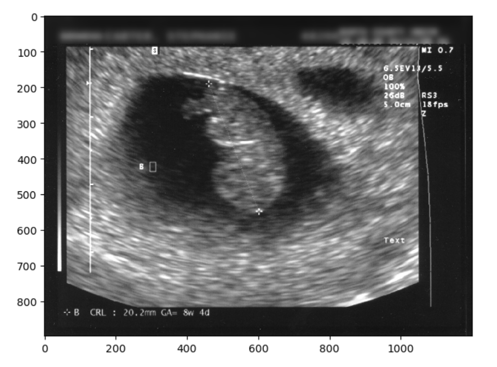
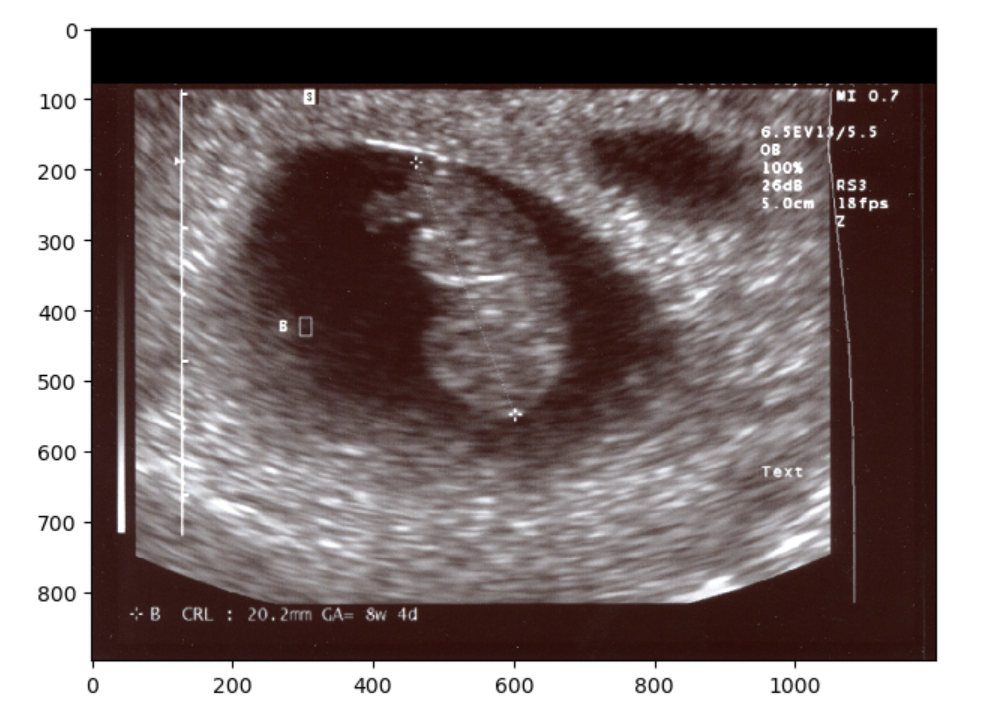

:::::::::::::::::::::::::::::::::::::: questions 

- What types of data make patient's imaging data identifiable?
- How can I ensure the safe sharing of medical image data?
- How can I remove specific metadata from DICOM files?
- How can I deal with identifying data within images themselves?

::::::::::::::::::::::::::::::::::::::::::::::::

::::::::::::::::::::::::::::::::::::: objectives

- Provide examples of data that makes patient images identifiable
- Discuss the concepts of identifiable data and anonymization
- Demonstrate how approaches to anonymizing identifiable images
- Demonstrate the use of the Pydicom library to manage DICOM metadata

::::::::::::::::::::::::::::::::::::::::::::::::

## Introduction

Each of us is similar yet unique, and this individuality can make us identifiable, posing challenges for medical research. While open data sharing advances research, most patients would not want their medical details shared if they could be identified. In most countries, patient information is protected by law.

Metadata elements in imaging, such as patient names and addresses, are often clearly designed to identify patients. However, the uniqueness of patients means that even images without obvious metadata, such as names, can potentially be identified as belonging to a specific individual. With advancements in facial recognition software and search engines, images we previously thought were non-identifiable, like head CTs, MRIs, [or even PET scans](https://doi.org/10.1016/j.neuroimage.2022.119357), can theoretically be traced back to a specific patient. To address this, we can implement de-identification strategies to create shareable data.

## Types of Patient Identifying Data 

### Metadata

DICOM files contain metadata, which includes various types of identifying information that should remain confidential. The easiest way to mitigate issues with DICOM metadata is to avoid having it in the first place. If possible, opt to receive just the images and select metadata rather than the entire DICOM file. When sharing data with collaborators, there is often no need to share the full DICOM files.


### Text on Images

Occasionally, technicians will "burn" information directly onto images. This means they change the image itself with text that becomes part of the image pixels. This "burned-in" annotation may include details such as diagnoses, demographics, or the patient's name. Fortunately, this text is usually typed rather than handwritten, making it recognizable by optical character recognition (OCR) functions. Often, this text is placed away from the center of the image, allowing for clever cropping to eliminate it entirely in some datasets.


::::::::::::::::::::::::::::::::::::::: challenge

## Challenge: Getting rid of identifying burned in data

An ultrasound (taken from the public internet on a creative commons license lisence [here](https://www.flickr.com/photos/jcarter/2461223727).) must be kept at it's existing height and width dimensions. You should change the image from RGB to grayscale for your operations. It can be opened as follows:

```python

import numpy as np
import matplotlib.pyplot as plt
from skimage import io, filters

image = 'data/anonym/identifiable_us.jpg'
io.imshow(image)
io.show()
```

```output
```

{alt='Identifiable ultrasound'}

Write code for more than one approach to de-identify (remove the annotations from) the ultrasound image data. 


::::::::::::::: solution

## Solution

The image  has identifying metadata. You should identify not only the name, but the date and place as problematic.  You can take three different approaches. One would be to mask the data, the other would be to blur it, and finally you can just crop it out entirely. First we will show a selectively blurred image:

```python

from skimage.filters import gaussian
from skimage.color import rgb2gray

image_base = io.imread(image)
image_base = rgb2gray(image_base)
sub_im = image_base[0:78,:].copy()
blur_sub_im = gaussian(sub_im, sigma=9)
final_image = np.zeros(image_base.shape)
final_image[0:78,:] = blur_sub_im
final_image[79:,:]= image_base[79:, :]
io.imshow(final_image)

```


```output
```

{alt='Non-Identifiable blurred ultrasound'}

We could have also just make a simple zero-mask: 

```python
image_masked = io.imread(image)
image_masked[0:78,:] = 0
io.imshow(image_masked)

```


```output
```

{alt='Non-Identifiable masked ultrasound'}


Finally, you could always just chop off the offending part so to speak, and resize. However if you examine the image when we try this solution you should notice that the image has changed in aspect ratio, thus pixels values have changed. This may not be the ideal solution for situations when you want to maintain the exact image pixels. Nonetheless you can crop and resize as below:

```python
from skimage.transform import resize

final_image= image_base[79:, :]
final_image = resize(final_image,image_base.shape)
io.imshow(final_image)
```

```output
```

{alt='Non-Identifiable cropped ultrasound'}
:::::::::::::::::::::::::

::::::::::::::::::::::::::::::::::::::::::::::::::

Note there are other valid solutions to getting rid of what is identifying image data, but the first two shown (blurring and masking) are very common and straightforward. You have now seen three approaches to removing some of the visual data on a 2-D image. The same approaches can be taken on a 3D image. 

Let's take another look at an image we used earlier:

```python
import matplotlib.pyplot as plt
import SimpleITK as sitk
from skimage import io
from ipywidgets import interact, fixed
from IPython.display import clear_output
import os


sag_image =  sitk.ReadImage("data/sitk/A1_grayT1.nrrd", sitk.sitkFloat32)
cor_image = sitk.PermuteAxes(sag_image, [2, 1, 0])

# General display function for any two 3D images
def display_images(image1_z, image2_z, image1_npa, image2_npa, title1="Image 1", title2="Image 2"):
    plt.subplots(1, 2, figsize=(10, 8))
    
    # Display the first image
    plt.subplot(1, 2, 1)
    plt.imshow(image1_npa[image1_z, :, :], cmap=plt.cm.Greys_r)
    plt.title(title1)
    plt.axis('off')
    
    # Display the second image
    plt.subplot(1, 2, 2)
    plt.imshow(image2_npa[image2_z, :, :], cmap=plt.cm.Greys_r)
    plt.title(title2)
    plt.axis('off')
    
    plt.show()

# Display the sagittal and coronal views of the original image
interact(
    display_images,
    image1_z=(0, sag_image.GetSize()[2] - 1),
    image2_z=(0, cor_image.GetSize()[2] - 1),
    image1_npa=fixed(sitk.GetArrayViewFromImage(sag_image)),
    image2_npa=fixed(sitk.GetArrayViewFromImage(cor_image)),
    title1=fixed("Sagittal Cut"),
    title2=fixed("Coronal Cut")
)
```
```output
```
{alt='Non-Identifiable head'}

Here we can see an analagous technique to one we used with the 2D ultrasound. Identifying data (the nose and part of the ears) has been cropped out. 

::::::::::::::::::::::::::::::::::::::: challenge 

## Challenge: Are we truly deidentified?(Optional)

Look at the head MRI above. Are all such images, including CTs, with some of the soft tissue stripped 100 percent deidentified? Give arguments why and why not


::::::::::::::: solution

## Solution

In most cases images like the above are de-identified. The image above is only an image, not a DICOM with potentially identifying metadata. Further we are missing the nose, therefore putting this in a reverse look-up engine online will not yield identifying results. On the other hand theoretically we could have an identifiable image. One potentially identifiable case could be someone with a very identifiable neck, skull bones (these will be more visible on CT) and/or ears. Additionally in the case of patients who have had some kind of rare pathology and surgery, they may still be identifiable for some familiar with their cases. 


:::::::::::::::::::::::::

::::::::::::::::::::::::::::::::::::::::::::::::::

### Faces in Images

A full CT, MRI, or PET scan of the head can be reconstructed into a detailed facial image, potentially revealing the patient's identity and demographic information, such as ethnicity and gender. To mitigate this risk, many image analysis programs employ ‘defacing’ techniques to obscure these identifiable features.


We could in theory write our own defacing algorithm. For such an algorithm libraries such as SITK or skimage (sci-kit image) or even openCV provide several useful built in functions including [morphological operations](learners/reference.md#Morphological operations) such as erosion, dilation, grow-from-seed and other types of operations such as connected component analysis and masking. Which library you choose will often be based on minimizing the number of libraries in your total code, because mixing close libraries with similarly named functions is a bad idea. 

::::::::::::::::::::::::::::::::::::::: challenge 

## Challenge: Soft tissue stripping(Optional)

Look at the head MRI above. Try using SITK to get rid of some of the soft tissue in the image (already loaded into sag_image). 


::::::::::::::: solution

## Solution

We can approach the problem in various ways. Below is one solution with erosion, dilation and masking:

```python
# Apply thresholding to remove soft tissues by first taking out the air then dilating and cleaning
# the assumption is that the black around the brain is zero and low values
# Create the brain mask
lower_thresh = 0
upper_thresh = 100
brain_mask = sitk.BinaryThreshold(sag_image, lowerThreshold=lower_thresh, upperThreshold=upper_thresh)

# Morphological operations to clean the mask
brain_mask_cleaned = sitk.BinaryDilate(brain_mask, [5, 5, 5])
brain_mask_cleaned = sitk.BinaryErode(brain_mask_cleaned, [5, 5, 5])

# Display the original and cleaned mask images using the general display function
interact(
    display_images,
    image1_z=(0, brain_mask.GetSize()[2] - 1),
    image2_z=(0, brain_mask_cleaned.GetSize()[2] - 1),
    image1_npa=fixed(sitk.GetArrayViewFromImage(brain_mask)),
    image2_npa=fixed(sitk.GetArrayViewFromImage(brain_mask_cleaned)),
    title1=fixed("Original Mask"),
    title2=fixed("Cleaned Mask")
)
```
Then we can further clean with a connected component analysis that throws out our small floaters, and use the inverse as out final mask.

```python

def keep_largest_component(mask_image):
    # Ensure mask_image is will work and use as little memory as possible 
    mask_image = sitk.Cast(mask_image, sitk.sitkUInt8)
    
    # Label connected components in the mask image
    labeled_image = sitk.ConnectedComponent(mask_image)
    
    # Measure the size of each labeled component
    label_shape_statistics = sitk.LabelShapeStatisticsImageFilter()
    label_shape_statistics.Execute(labeled_image)
    
    # Count and print the number of connected components
    component_count = len(label_shape_statistics.GetLabels())
    print(f"Number of connected components before filtering: {component_count}")
    
    # Find the label with the largest size
    largest_label = max(
        label_shape_statistics.GetLabels(),
        key=lambda label: label_shape_statistics.GetPhysicalSize(label)
    )
    
    # Create a new mask with only the largest component
    largest_component_mask = sitk.BinaryThreshold(labeled_image, lowerThreshold=largest_label, upperThreshold=largest_label, insideValue=1, outsideValue=0)
    
    # Verify the result by counting the components in the resulting image
    labeled_result = sitk.ConnectedComponent(largest_component_mask)
    label_shape_statistics.Execute(labeled_result)
    result_component_count = len(label_shape_statistics.GetLabels())
    print(f"Number of connected components after filtering: {result_component_count}")
    
    return largest_component_mask

largest_component_mask = keep_largest_component(brain_mask_cleaned)
# we actually want the opposite mask so we will invert the mask
inverted_mask = sitk.BinaryNot(largest_component_mask) 
# Apply the mask to the image
brain_only = sitk.Mask(sag_image, inverted_mask)

interact(
    display_images,
    image1_z = (0,brain_only.GetSize()[2]-1),
    image2_z = (0,largest_component_mask.GetSize()[2]-1),
    image1_npa = fixed(sitk.GetArrayViewFromImage(brain_only)),
    image2_npa = fixed(sitk.GetArrayViewFromImage(largest_component_mask)),
    title1=fixed("new image"),
    title2=fixed("mask")
    )


```
```output
```

{alt='Home-made deface'}


 Now you may notice that we put together and erosion and dilation, and we could have used instead a closure. There are many ways to solve this problem. An entirely different approach would be to use grow-from seed as below (not this may take a while to execute):

 ```python
 def guess_seed_point(img):
    """
    This function guesses a seed point for the brain in the middle of the image, and returns some seed points.
    """
    possible_point = img.GetSize()[0]//2, img.GetSize()[1]//2, img.GetSize()[2]//2
    # Get the pixel value at the potential location
    pixel_value = img.GetPixel(*possible_point)
    if pixel_value > 0:
        picked_point = possible_point
    else:
        # just move over a bit and hope for better
        new_possible_point = img.GetSize()[0]//2 + img.GetSize()[0]//10 , img.GetSize()[1]//2, img.GetSize()[2]//2
        picked_point = new_possible_point
    return picked_point
# do some reality check of a look at the value in your seed point  
seed_point = guess_seed_point(sag_image) 
pixel_value = sag_image.GetPixel(seed_point)
print(pixel_value)
 ```

 ```output
 394.37042236328125
 ```

Grow from seed, then display:


 ```python
seed_point = guess_seed_point(sag_image)  
lower_threshold = 370   # lower threshold
upper_threshold = 480   # upper threshold


seed_mask = sitk.ConnectedThreshold(
    sag_image, seedList=[seed_point],
    lower=lower_threshold,
    upper=upper_threshold)
# let's dilate up a bit
seed_mask= sitk.BinaryDilate(seed_mask, [5, 5, 5])

# apply the mask to the image
brain_only = sitk.Mask(sag_image, seed_mask)
# display to see what happened
interact(
    display_images,
    image1_z=(0, sag_image.GetSize()[2] - 1),
    image2_z=(0, brain_only.GetSize()[2] - 1),
    image1_npa=fixed(sitk.GetArrayViewFromImage(sag_image)),
    image2_npa=fixed(sitk.GetArrayViewFromImage(brain_only)),
    title1=fixed("Original"),
    title2=fixed("Seeded and Masked")
)
 ```


 ```output
```

{alt='Home-made deface by grow from seed'}

 In the two solutions above we made masks. They each have different problems we can see. For example in the grown from seed images we stripped out part of the genu and splenium of the corpus callosum not to mention the entire pons. An alternative is that could also have used a registered atlas as a mask. Regardless of the base algorithms we begin with, if we want a better image, we can keep tinkering with our algorithms.

:::::::::::::::::::::::::


::::::::::::::::::::::::::::::::::::::::::::::::::

In the provided solutions to the above optional challenge we didn't get rid of a lot of the neck, and had other issues. A different approach we could have taken would have been to register the brain to a brain-like shape and use this as a mask. Nonetheless the given solutions shows two potential approaches to removing tissue (which could in some cases lead to identification) you don't want in an image. Many researchers do not want to waste time optimizing a skull stripping technique if this was not the research question, so they use a pre-made technique.


There are various tools available for defacing head imaging, ranging from fully developed software products like [FreeSurfer](https://surfer.nmr.mgh.harvard.edu/), which includes built-in defacing capabilities, to specialized functions within coding libraries. Some of these tools strip off all of the skull and soft tissue which may be useful for analysis even if we don't care about deidentification e.g. if we only want to look at brain tissue.  

Unfortunately a key issue under current investigation is that some defacing algorithms may inadvertently alter more than just the facial features. Emerging research suggests that these algorithms might also affect the morphometry of the brain image. This could lead to the unintended loss or distortion of critical data. Therefore, it is advisable to proceed with caution and, whenever possible, compare the original and defaced images to ensure that important information remains intact and unaltered.

.](fig/deface-example.jpg){alt='Defacing examples'}


### Other Parts of Images

Patient identity can often be inferred with just a few pieces of data. In some cases, a single piece of information can be enough to track down a patient's identity, especially if medical files are accessible. For instance, a serial number or other identifying number on a medical device may be traceable back to a specific patient.

In other situations, slightly more data might be required to identify a patient. Some patients may wear unique jewelry, such as a MedicAlert bracelet or necklace with initials or a name. While most routine ambulatory images are taken without jewelry, in emergency situations, medical personnel may not have had the time to remove these items. The more data points we have on a patient, the easier it becomes to identify them.

{alt='jewlery artifact'}


### Metadata

Metadata is in the broadest sense data about our data. In the practical sense we need to understand it is a place outside the image that identifying data may be lurking in. 

Various tools are available to help de-identify DICOM files in terms of metadata. A notable one is [DicomAnonymizer](https://github.com/KitwareMedical/dicom-anonymizer), an open-source tool written in Python.

In some cases, you may need to examine and remove metadata manually or programmatically. For example, in some countries, DICOM fields are used inconsistently, and patient-identifying data can appear in unexpected fields. Therefore, careful examination and customized removal of metadata may be necessary.

::::::::::::::: callout

## Many Ways to Handle a DICOM:

- Multiple libraries, such as Pydicom and SimpleITK (SITK), allow you to read, access, and manipulate DICOM metadata.
- DICOMs follow an extremely complex [standard](https://www.dicomstandard.org/), so it is usually better to use existing libraries rather than raw Python to handle them.

:::::::::::::::::::::

For various reasons, we may prefer Pydicom, SITK, or another method to handle DICOM metadata, typically based on the principle of minimizing dependencies and maintaining simplicity. SITK was introduced earlier in this course. Pydicom is an excellent alternative, particularly because of its comprehensive [documentation](https://pydicom.github.io/pydicom/stable/).

Now, let's see how to open a DICOM file and work with it using Pydicom.

First, let's import Pydicom and read in a CT scan:

```python
import pydicom
from pydicom import dcmread
fpath = "data/anonym/our_sample_dicom.dcm"
ds = dcmread(fpath)
print(ds)
```

```output
Dataset.file_meta -------------------------------
(0002, 0000) File Meta Information Group Length  UL: 218
(0002, 0001) File Meta Information Version       OB: b'\x00\x01'
(0002, 0002) Media Storage SOP Class UID         UI: CT Image Storage
(0002, 0003) Media Storage SOP Instance UID      UI: 1.3.46.670589.33.1.63849049636503447100001.4758671761353145811
(0002, 0010) Transfer Syntax UID                 UI: JPEG Lossless, Non-Hierarchical, First-Order Prediction (Process 14 [Selection Value 1])
(0002, 0012) Implementation Class UID            UI: 1.2.840.113845.1.1
(0002, 0013) Implementation Version Name         SH: 'Syn7,3,0,258'
(0002, 0016) Source Application Entity Title     AE: 'SynapseDicomSCP'
-------------------------------------------------
(0008, 0005) Specific Character Set              CS: 'ISO_IR 100'
(0008, 0008) Image Type                          CS: ['DERIVED', 'SECONDARY', 'MPR']
(0008, 0012) Instance Creation Date              DA: '20240418'
(0008, 0013) Instance Creation Time              TM: '150716.503'
(0008, 0016) SOP Class UID                       UI: CT Image Storage
(0008, 0018) SOP Instance UID                    UI: 1.3.46.670589.33.1.63849049636503447100001.4758671761353145811
(0008, 0020) Study Date                          DA: '20240418'
(0008, 0022) Acquisition Date                    DA: '20240418'
(0008, 0023) Content Date                        DA: '20240418'
(0008, 002a) Acquisition DateTime                DT: '20240418150313.020'
(0008, 0030) Study Time                          TM: '150045'
(0008, 0032) Acquisition Time                    TM: '150313'
(0008, 0033) Content Time                        TM: '150314.375'
(0008, 0050) Accession Number                    SH: '2001433888'
(0008, 0060) Modality                            CS: 'CT'
(0008, 0070) Manufacturer                        LO: 'Philips'
(0008, 0080) Institution Name                    LO: 'BovenIJ Ziekenhuis iCT'
(0008, 0081) Institution Address                 ST: ''
(0008, 0090) Referring Physician's Name          PN: 'WILTING^I^I^""'
(0008, 1010) Station Name                        SH: 'HOST-999999'
(0008, 1030) Study Description                   LO: 'CT thorax met iv contrast'
(0008, 103e) Series Description                  LO: 'Cor IMR med'
(0008, 1040) Institutional Department Name       LO: 'Radiology'
(0008, 1080) Admitting Diagnoses Description     LO: ''
(0008, 1084)  Admitting Diagnoses Code Sequence  0 item(s) ---- 
(0008, 1090) Manufacturer's Model Name           LO: 'iCT 256'
(0008, 1111)  Referenced Performed Procedure Step Sequence  1 item(s) ---- 
   (0008, 1150) Referenced SOP Class UID            UI: Modality Performed Procedure Step SOP Class
   (0008, 1155) Referenced SOP Instance UID         UI: 1.3.46.670589.33.1.63849049241567858000001.4675122277016890611
   ---------
(0008, 1140)  Referenced Image Sequence  1 item(s) ---- 
   (0008, 1150) Referenced SOP Class UID            UI: CT Image Storage
   (0008, 1155) Referenced SOP Instance UID         UI: 1.3.46.670589.33.1.63849049294969912500001.5475332148846191441
   ---------
(0008, 3010) Irradiation Event UID               UI: 1.3.46.670589.33.1.63849049343237673200010.5507538603167078985
(0010, 0010) Patient's Name                      PN: 'OurBeloved^Colleague'
(0010, 0020) Patient ID                          LO: 'party like 1999'
(0010, 0030) Patient's Birth Date                DA: '19421104'
(0010, 0040) Patient's Sex                       CS: 'M'
(0010, 1000) Other Patient IDs                   LO: '1989442112'
(0010, 1010) Patient's Age                       AS: '041Y'
(0018, 0010) Contrast/Bolus Agent                LO: 'Iodine'
(0018, 0015) Body Part Examined                  CS: 'CHEST'
(0018, 0022) Scan Options                        CS: 'HELIX'
(0018, 0050) Slice Thickness                     DS: '2.0'
(0018, 0060) KVP                                 DS: '100.0'
(0018, 0088) Spacing Between Slices              DS: '2.0'
(0018, 0090) Data Collection Diameter            DS: '500.0'
(0018, 1000) Device Serial Number                LO: ''
(0018, 1020) Software Versions                   LO: '4.1'
(0018, 1030) Protocol Name                       LO: 'Thorax std /Thorax'
(0018, 1040) Contrast/Bolus Route                LO: 'IV'
(0018, 1041) Contrast/Bolus Volume               DS: '80.0'
(0018, 1044) Contrast/Bolus Total Dose           DS: '40.0'
(0018, 1046) Contrast Flow Rate                  DS: [3, 3]
(0018, 1047) Contrast Flow Duration              DS: [17, 10]
(0018, 1049) Contrast/Bolus Ingredient Concentra DS: '300.0'
(0018, 1100) Reconstruction Diameter             DS: '348.0'
(0018, 1110) Distance Source to Detector         DS: '1040.0'
(0018, 1111) Distance Source to Patient          DS: '570.0'
(0018, 1120) Gantry/Detector Tilt                DS: '0.0'
(0018, 1130) Table Height                        DS: '85.1'
(0018, 1150) Exposure Time                       IS: '434'
(0018, 1151) X-Ray Tube Current                  IS: '258'
(0018, 1152) Exposure                            IS: '108'
(0018, 1160) Filter Type                         SH: 'IMR'
(0018, 1210) Convolution Kernel                  SH: 'IMR1,Soft Tissue'
(0018, 5100) Patient Position                    CS: 'FFS'
(0018, 9305) Revolution Time                     FD: 0.33
(0018, 9306) Single Collimation Width            FD: 0.625
(0018, 9307) Total Collimation Width             FD: 80.0
(0018, 9309) Table Speed                         FD: 185.0
(0018, 9310) Table Feed per Rotation             FD: 97.664
(0018, 9311) Spiral Pitch Factor                 FD: 0.763
(0018, 9345) CTDIvol                             FD: 4.330253533859318
(0018, a001)  Contributing Equipment Sequence  1 item(s) ---- 
   (0008, 0070) Manufacturer                        LO: 'PHILIPS'
   (0008, 0080) Institution Name                    LO: 'BRILLIANCE4'
   (0008, 0081) Institution Address                 ST: 'BRILLIANCE4'
   (0008, 1010) Station Name                        SH: 'HOST-999999'
   (0008, 1040) Institutional Department Name       LO: 'BRILLIANCE4'
   (0008, 1090) Manufacturer's Model Name           LO: 'BRILLIANCE4'
   (0018, 1000) Device Serial Number                LO: 'BRILLIANCE4'
   (0018, 1020) Software Versions                   LO: '4.5.0.30020'
   (0040, a170)  Purpose of Reference Code Sequence  1 item(s) ---- 
      (0008, 0100) Code Value                          SH: '109102'
      (0008, 0102) Coding Scheme Designator            SH: 'DCM'
      (0008, 0104) Code Meaning                        LO: 'Processing Equipment'
      ---------
   ---------
(0020, 000d) Study Instance UID                  UI: 1.3.46.670589.33.1.63849049241560857600001.4706589000974752499
(0020, 000e) Series Instance UID                 UI: 1.3.46.670589.33.1.63849049343237673200004.5226562961912261811
(0020, 0010) Study ID                            SH: '8041'
(0020, 0011) Series Number                       IS: '203'
(0020, 0012) Acquisition Number                  IS: '2'
(0020, 0013) Instance Number                     IS: '1'
(0020, 0032) Image Position (Patient)            DS: [-172.7884, 8.90000000000001, 1201.43792746114]
(0020, 0037) Image Orientation (Patient)         DS: [1, 0, 0, 0, 0, -1]
(0020, 0052) Frame of Reference UID              UI: 1.3.46.670589.33.1.63849049263758127200002.5362237490253193614
(0020, 1040) Position Reference Indicator        LO: ''
(0020, 4000) Image Comments                      LT: 'Cor IMR med'
(0028, 0002) Samples per Pixel                   US: 1
(0028, 0004) Photometric Interpretation          CS: 'MONOCHROME2'
(0028, 0010) Rows                                US: 832
(0028, 0011) Columns                             US: 772
(0028, 0030) Pixel Spacing                       DS: [0.4507772, 0.4507772]
(0028, 0100) Bits Allocated                      US: 16
(0028, 0101) Bits Stored                         US: 12
(0028, 0102) High Bit                            US: 11
(0028, 0103) Pixel Representation                US: 0
(0028, 1050) Window Center                       DS: [50, 50]
(0028, 1051) Window Width                        DS: [350, 350]
(0028, 1052) Rescale Intercept                   DS: '-1024.0'
(0028, 1053) Rescale Slope                       DS: '1.0'
(0032, 1033) Requesting Service                  LO: 'CHIPSOFT'
(0040, 1001) Requested Procedure ID              SH: 'CT5001IV'
(0054, 1001) Units                               CS: 'HU'
(00e1, 0010) Private Creator                     LO: 'ELSCINT1'
(00e1, 1036) Private tag data                    CS: 'YES'
(00e1, 1040) [Image Label]                       SH: 'Cor IMR med'
(00e1, 1046) Private tag data                    OB: Array of 512 elements
(01f1, 0010) Private Creator                     LO: 'ELSCINT1'
(01f1, 1001) [Acquisition Type]                  CS: 'SPIRAL'
(01f1, 1002) [Unknown]                           CS: 'STANDARD'
(01f1, 100e) [Unknown]                           FL: 0.0
(01f1, 1027) [Rotation Time]                     DS: '0.33'
(01f1, 1032) [Image View Convention]             CS: 'RIGHT_ON_LEFT'
(01f1, 104a) [Unknown]                           SH: 'DOM'
(01f1, 104b) [Unknown]                           SH: '128x0.625'
(01f1, 104d) [Unknown]                           SH: 'NO'
(01f1, 104e) [Unknown]                           SH: 'Chest'
(01f1, 1054) Private tag data                    IS: '11'
(01f1, 1056) Private tag data                    LO: '30.0451206729581'
(01f7, 0010) Private Creator                     LO: 'ELSCINT1'
(01f7, 1022) [Unknown]                           UI: 1.3.46.670589.33.1.63849049343237673200010.5507538603167078985
(07a1, 0010) Private Creator                     LO: 'ELSCINT1'
(07a1, 1010) [Tamar Software Version]            LO: '4.0.0'
(7fe0, 0010) Pixel Data                          OB: Array of 309328 elements
```

::::::::::::::::::::::::::::::::::::::: challenge

## Challenge: Identifying Safe Metadata in DICOM

Can you determine which metadata for this CT scan is likely safe, meaning it does not lead to patient identification? When would you choose to retain such data?

::::::::::::::: solution

## Solution

Metadata related to the machine, image type, and file type are generally safe. This information is particularly valuable when sorting through numerous DICOM files to locate specific types of images or when generating tabular data for harmonization purposes.

:::::::::::::::::::::::::

::::::::::::::::::::::::::::::::::::::::::::::::::

We can modify elements of our DICOM metadata:

```python
elem = ds[0x0010, 0x0010]
print(elem.value)
```

```output
'OurBeloved^Colleague'
```

```python
elem.value = 'Citizen^Almoni'
print(elem)
```

```output
(0010, 0010) Patient's Name                      PN: 'Citizen^Almoni'
```

In some cases, as here we are dealing with a standard [keyword](https://pydicom.github.io/pydicom/stable/reference/generated/pydicom.dataelem.DataElement.html#pydicom.dataelem.DataElement.keyword). The keyword `PatientName` is in programming terms technically a property of the class `FileDataset`, but here we are using "keyword" to refer to it and other very standard properties of the DICOM. Certain keywords can be modified as it follows:

```python
ds.PatientName = 'Almoni^Shmalmoni'
print(elem)
```

```output
(0010, 0010) Patient's Name                      PN: 'Almoni^Shmalmoni' 
```

You can also just set an element to empty by using None:

```python
ds.PatientName = None
print(elem)
```

```output
(0010, 0010) Patient's Name                      PN: None
```

You can also delete and add elements. After making modifications, remember to save your file:

```python
ds.save_as('data/anonym/my_modified_dicom.dcm')
```

We recommend removing at least the patient IDs and birthdates in most cases. Additionally, consider examining the data elements 'OtherPatientIDs' and 'OtherPatientIDsSequence'.

:::::::::::::::::::::::::::::::::::::::  challenge

## Challenge: Accessing Additional Patient Identifying Data

How can you access and print additional patient identifying data?
Hint: Refer to the documentation and compare with what we have already printed.

:::::::::::::::  solution

## Solution

```python
print(ds.PatientBirthDate)
print(ds.PatientID)
print(ds.OtherPatientIDs)
print(ds.PatientSex)
print(ds.PatientAge)
```

```output
19421104
party like 1999
1989442112
M
41Y
````
:::::::::::::::::::::::::

::::::::::::::::::::::::::::::::::::::::::::::::::

Pydicom offers a wide range of capabilities. You can visualize your DICOM data in a hierarchical tree format for user-friendly GUI reading. It supports downsizing images and handling waveform data such as EKGs. By integrating with Matplotlib, you can load and plot files seamlessly. Before adding additional libraries, explore Pydicom's full potential to leverage its extensive functionalities.

:::::::::::::::::::::::::::::::::::::::: keypoints

- Certain metadata should almost always be removed from DICOM files before sharing
- Automated tools are available to strip metadata from DICOMs, but manual verification is necessary due to inconsistencies in how fields are utilized
- Several Python libraries enable access to DICOM metadata
- Sharing only image files such as JPEGs or NIfTI can mitigate risks associated with metadata
- Imaging data alone, even without explicit metadata, can sometimes lead to patient identification
- You may need to preprocess images themselves so patients are de-identified 
- Tools exist to deface head images to further protect patient identity

::::::::::::::::::::::::::::::::::::::::::::::::::
