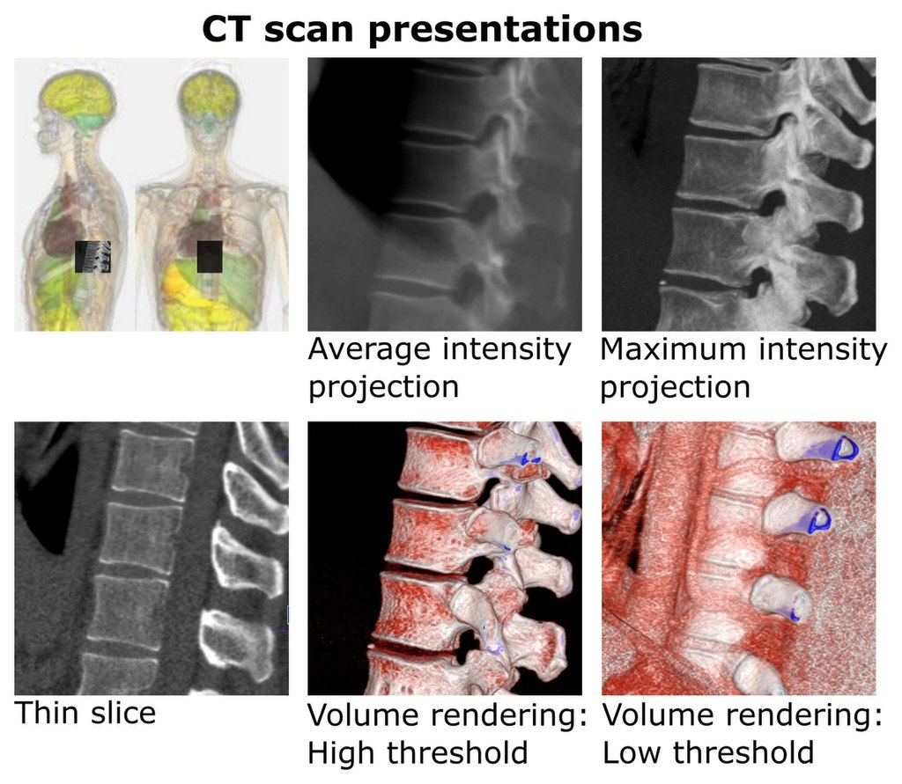
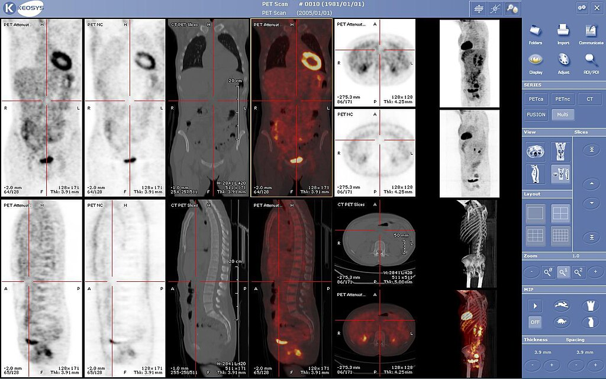

:::::::::::::::::::::::::::::::::::::: questions 

- What kinds of CTs are there?
- How can I create fusion images between CTs and other images?
- How can I visualize CT data?
- What is volume rendering?

::::::::::::::::::::::::::::::::::::::::::::::::

::::::::::::::::::::::::::::::::::::: objectives

- Show common kinds of CT imaging used in research
- Explain fusion images and demonstrate
- Explain the concept of windowing
- Explain different visualizations of CT data including MIP, MinIP and volume rendering


::::::::::::::::::::::::::::::::::::::::::::::::

## Introduction

There are various types of CTs and various ways to visualize them. 
Here we will briefly mention some emerging types of CTs so you can know what to expect in terms of the data and file types. Then we will explore algorithms for visualization. Someone without a background in radiology might assume that once a CT is converted out of a <>sinogram<> into a scrollable image, there is little left to be done. This depends upon your perspective. For human readers who want to do any kind of qualitative analysis, or even in some cases simply check the results of a machine learning algorithm, various visualization techniques can be of use. These include not only maximum intensity and minimum intensity projections but also volume rendering or even taking the CT out of the computer into 3D printing, holograms or virtual reality. In other cases we will want to visualize the CT and another modality at the same time. This is accomplished with fusion imaging. The basics of some visualizations will be covered in this episode as visualization is a worthy and active research topic in and of itself. 


### Different types of CT data

From the perspective of computation there is not always a significant difference in all CTs even if they have different acquisition protocols. For example a high resolution CT (HRCT) may look prettier, and have had a different scanning protocol,  but in the end we still have a 3D array of voxels albeit with different real-world measurements. There are however a few kinds of CT where the shape of the data will be different. 

The most prominent case of this is perfusion CT where the data is taken to show blood flow.  TRATRA
HERE WE WILL PUT IN AN EXPLANATION ABOUT THESE FILES

Another newer technology with a different sort of data is 4D CT. 4D CT is multiple 3D CTs acquired over various time points. Clinically this type is not standard, but it is an area of active research for various problems such as assesing joint motion or precise calculation of the behaviours of contrast materials given to patients. 4D CTs will usually be put inside a DICOM, but the possible file formats vary. In the easy and thankfully not uncommon case scenario the image is simply a set of 3D images with metadata in the DICOM that give each image a time tag. In this case you can use all the tools you are familiar with, and often SITK will provide well implemented algorithms for basic processing. However, in some cases 4DCT data can be in videos or other file types.

### Visualizations

Most clinicans will see CTs by scrolling through them on a PACS system. Such software will have tools to provide certain projections i.e. maximium intensity projection and minimum intensity projection and even volume rendering automatically.
Let's look at an image where some different projections are rendered. 

{alt='CT visualization images.'}

*sourced from Mikael Häggström & Anatomography, CC BY-SA 2.1 JP <https://creativecommons.org/licenses/by-sa/2.1/jp/deed.en>, via Wikimedia Commons*
As you can imagine each type of visualization leds itself to awnsering different questions. 


HERE example code for min and mip, explanation of connection to ray casting


With all the infinite kinds of visualizations we could invent, there are however some questions where you simply want more than a CT. A possible case of this is when you want to see both bones, and soft tissue well so you fuse CT and MRI. The classic case is of course PET-CT. These images are  If you have gone through the material sequentially, you should already know how to do a registration.   


{alt='PET-CT visualization images.'}
*sourced from Mco44, Public domain, via Wikimedia Commons*

Fusion imaging can be made simply by just adding two registered images. However, many software packages allow this to be done in a more elegant manner because if the point is optimal visualization, you will want to think about the intensity and color mapping of the images you add them together. 


here example code of fusion


```python
import numpy as np
import matplotlib.pyplot as plt
from skimage import io, color, img_as_float

# Load two images (assuming grayscale, convert to RGB one)
image1 = io.imread('image1.jpg')  
image2 = io.imread('image2.jpg')  

# Convert to grayscale if they are in color
if len(image1.shape) == 3:
    image1 = color.rgb2gray(image1)

if len(image2.shape) == 3:
#    image2 = color.rgb2gray(image2)

# Convert images to float (skimage handles images as floats between 0 and 1)
image1 = img_as_float(image1)
image2 = img_as_float(image2)

# Normalize both images to the same shape (smallest common size)
min_shape = (min(image1.shape[0], image2.shape[0]), min(image1.shape[1], image2.shape[1]))
image1_resized = image1[:min_shape[0], :min_shape[1]]
image2_resized = image2[:min_shape[0], :min_shape[1]]

# Perform fusion by averaging the pixel values
fused_image = (image1_resized + image2_resized) / 2

# Display the results
fig, axes = plt.subplots(1, 3, figsize=(12, 4))
ax = axes.ravel()

ax[0].imshow(image1_resized, cmap='gray')
ax[0].set_title("Image 1")
ax[1].imshow(image2_resized, cmap='gray')
ax[1].set_title("Image 2")
ax[2].imshow(fused_image,)
ax[2].set_title("Fused Image")

for a in ax:
    a.axis('off')

plt.tight_layout()
plt.show()

# Save the fused image if needed
io.imsave('fused_image.jpg', fused_image)
```

