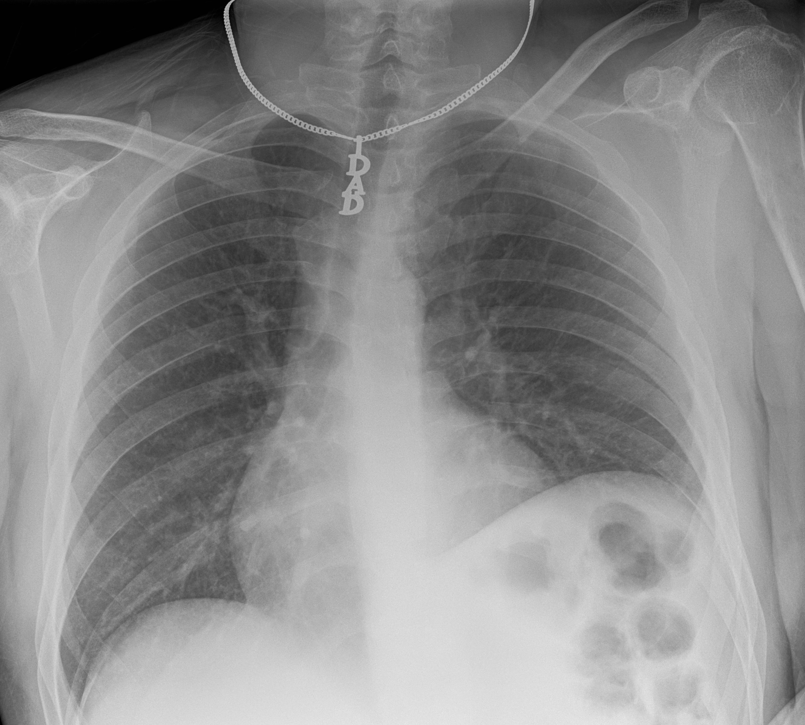

:::::::::::::::::::::::::::::::::::::: questions 

- What types of data make patient's imaging data identifiable?
- How can I ensure the safe sharing of medical image data?
- How can I remove specific metadata from DICOM files?

::::::::::::::::::::::::::::::::::::::::::::::::

::::::::::::::::::::::::::::::::::::: objectives

- Provide examples of data that makes patient images identifiable
- Discuss the concept of anonymization
- Demonstrate the use of the Pydicom library to manage DICOM metadata

::::::::::::::::::::::::::::::::::::::::::::::::

## Introduction

Each of us is similar yet unique, and this individuality can make us identifiable, posing challenges for medical research. While open data sharing advances research, most patients would not want their medical details shared if they could be identified. In most countries, patient information is protected by law.

Metadata elements in imaging, such as patient names and addresses, are often clearly designed to identify patients. However, the uniqueness of patients means that even images without obvious metadata, such as names, can potentially be identified as belonging to a specific individual. With advancements in facial recognition software and search engines, images we previously thought were non-identifiable, like head CTs, MRIs, [or even PET scans](https://doi.org/10.1016/j.neuroimage.2022.119357), can theoretically be traced back to a specific patient. To address this, we can implement de-identification strategies to create shareable data.

:::::::::::::::::::::::::::::::::::::::::::::::::::::::::::::::::::: instructor

Inline instructor notes: if Zenodo is unavailable ...

::::::::::::::::::::::::::::::::::::::::::::::::::::::::::::::::::::::::::::::::

## Types of patient identifying data 

### Metadata

DICOM files contain metadata, which includes various types of identifying information that should remain confidential. The easiest way to mitigate issues with DICOM metadata is to avoid having it in the first place. If possible, opt to receive just the images and select metadata rather than the entire DICOM file. When sharing data with collaborators, there is often no need to share the full DICOM files.

### Faces in images

A full CT, MRI, or PET scan of the head can be reconstructed into a face. To prevent this, many image analysis programs 'deface' these types of images, which helps to obscure the patient's specific identity as well as some demographic information (e.g., ethnicity and gender).

Various tools are available for defacing head imaging, ranging from fully developed software products like [FreeSurfer](https://surfer.nmr.mgh.harvard.edu/), which has built-in defacing capabilities, to functions within code libraries.

### Text on images

Occasionally, technicians will burn information directly onto images as part of a burned-in annotation. This may include details such as diagnoses, demographics, or the patient's name. Fortunately, this text is usually typed rather than handwritten, making it recognizable by optical character recognition (OCR) functions. Often, this text is placed away from the center of the image, allowing for clever cropping to eliminate it entirely in some datasets.

### Other parts of images

Patient identity can often be inferred with just a few pieces of data. In some cases, a single piece of information can be enough to track down a patient's identity, especially if medical files are accessible. For instance, a serial number or other identifying number on a medical device may be traceable back to a specific patient.

In other situations, slightly more data might be required to identify a patient. Some patients may wear unique jewelry, such as a MedicAlert bracelet or necklace with initials or a name. While most routine ambulatory images are taken without jewelry, in emergency situations, medical personnel may not have had the time to remove these items. The more data points we have on a patient, the easier it becomes to identify them.

{alt='jewlery artifact'}


Various tools are available to help de-identify DICOM files in terms of metadata. A notable one is [DicomAnonymizer](https://github.com/KitwareMedical/dicom-anonymizer), an open-source tool written in Python.

In some cases, you may need to examine and remove metadata manually or programmatically. For example, in some countries, DICOM fields are used inconsistently, and patient-identifying data can appear in unexpected fields. Therefore, careful examination and customized removal of metadata may be necessary.


::::::::::::::: callout

## Many ways to "skin" a DICOM:

- Multiple libraries, such as Pydicom and SimpleITK (SITK), allow you to read, access, and manipulate DICOM metadata.
- DICOMs follow an extremely complex [standard](https://www.dicomstandard.org/), so it is usually better to use existing libraries rather than raw Python to handle them.

:::::::::::::::::::::

For various reasons, we may prefer Pydicom, SITK, or another method to handle DICOM metadata, typically based on the principle of minimizing dependencies and maintaining simplicity. SITK was introduced earlier in this course. Pydicom is an excellent alternative, particularly because of its comprehensive [documentation](https://pydicom.github.io/pydicom/stable/).

Now, let's see how to open a DICOM file and work with it using Pydicom.

First, let's import Pydicom and read in a CT scan:

```python
import pydicom
from pydicom import dcmread
from pydicom.data import get_testdata_file
fpath = "our_sample_dicom.dcm"
ds = dcmread(fpath)
print(ds)
```

```output
Dataset.file_meta -------------------------------
(0002, 0000) File Meta Information Group Length  UL: 218
(0002, 0001) File Meta Information Version       OB: b'\x00\x01'
(0002, 0002) Media Storage SOP Class UID         UI: CT Image Storage
(0002, 0003) Media Storage SOP Instance UID      UI: 1.3.46.670589.33.1.63849049636503447100001.4758671761353145811
(0002, 0010) Transfer Syntax UID                 UI: JPEG Lossless, Non-Hierarchical, First-Order Prediction (Process 14 [Selection Value 1])
(0002, 0012) Implementation Class UID            UI: 1.2.840.113845.1.1
(0002, 0013) Implementation Version Name         SH: 'Syn7,3,0,258'
(0002, 0016) Source Application Entity Title     AE: 'SynapseDicomSCP'
-------------------------------------------------
(0008, 0005) Specific Character Set              CS: 'ISO_IR 100'
(0008, 0008) Image Type                          CS: ['DERIVED', 'SECONDARY', 'MPR']
(0008, 0012) Instance Creation Date              DA: '20240418'
(0008, 0013) Instance Creation Time              TM: '150716.503'
(0008, 0016) SOP Class UID                       UI: CT Image Storage
(0008, 0018) SOP Instance UID                    UI: 1.3.46.670589.33.1.63849049636503447100001.4758671761353145811
(0008, 0020) Study Date                          DA: '20240418'
(0008, 0022) Acquisition Date                    DA: '20240418'
(0008, 0023) Content Date                        DA: '20240418'
(0008, 002a) Acquisition DateTime                DT: '20240418150313.020'
(0008, 0030) Study Time                          TM: '150045'
(0008, 0032) Acquisition Time                    TM: '150313'
(0008, 0033) Content Time                        TM: '150314.375'
(0008, 0050) Accession Number                    SH: '2001433888'
(0008, 0060) Modality                            CS: 'CT'
(0008, 0070) Manufacturer                        LO: 'Philips'
(0008, 0080) Institution Name                    LO: 'BovenIJ Ziekenhuis iCT'
(0008, 0081) Institution Address                 ST: ''
(0008, 0090) Referring Physician's Name          PN: 'WILTING^I^I^""'
(0008, 1010) Station Name                        SH: 'HOST-999999'
(0008, 1030) Study Description                   LO: 'CT thorax met iv contrast'
(0008, 103e) Series Description                  LO: 'Cor IMR med'
(0008, 1040) Institutional Department Name       LO: 'Radiology'
(0008, 1080) Admitting Diagnoses Description     LO: ''
(0008, 1084)  Admitting Diagnoses Code Sequence  0 item(s) ---- 
(0008, 1090) Manufacturer's Model Name           LO: 'iCT 256'
(0008, 1111)  Referenced Performed Procedure Step Sequence  1 item(s) ---- 
   (0008, 1150) Referenced SOP Class UID            UI: Modality Performed Procedure Step SOP Class
   (0008, 1155) Referenced SOP Instance UID         UI: 1.3.46.670589.33.1.63849049241567858000001.4675122277016890611
   ---------
(0008, 1140)  Referenced Image Sequence  1 item(s) ---- 
   (0008, 1150) Referenced SOP Class UID            UI: CT Image Storage
   (0008, 1155) Referenced SOP Instance UID         UI: 1.3.46.670589.33.1.63849049294969912500001.5475332148846191441
   ---------
(0008, 3010) Irradiation Event UID               UI: 1.3.46.670589.33.1.63849049343237673200010.5507538603167078985
(0010, 0010) Patient's Name                      PN: 'OurBeloved^Colleague'
(0010, 0020) Patient ID                          LO: 'party like 1999'
(0010, 0030) Patient's Birth Date                DA: '19421104'
(0010, 0040) Patient's Sex                       CS: 'M'
(0010, 1000) Other Patient IDs                   LO: '1989442112'
(0010, 1010) Patient's Age                       AS: '041Y'
(0018, 0010) Contrast/Bolus Agent                LO: 'Iodine'
(0018, 0015) Body Part Examined                  CS: 'CHEST'
(0018, 0022) Scan Options                        CS: 'HELIX'
(0018, 0050) Slice Thickness                     DS: '2.0'
(0018, 0060) KVP                                 DS: '100.0'
(0018, 0088) Spacing Between Slices              DS: '2.0'
(0018, 0090) Data Collection Diameter            DS: '500.0'
(0018, 1000) Device Serial Number                LO: ''
(0018, 1020) Software Versions                   LO: '4.1'
(0018, 1030) Protocol Name                       LO: 'Thorax std /Thorax'
(0018, 1040) Contrast/Bolus Route                LO: 'IV'
(0018, 1041) Contrast/Bolus Volume               DS: '80.0'
(0018, 1044) Contrast/Bolus Total Dose           DS: '40.0'
(0018, 1046) Contrast Flow Rate                  DS: [3, 3]
(0018, 1047) Contrast Flow Duration              DS: [17, 10]
(0018, 1049) Contrast/Bolus Ingredient Concentra DS: '300.0'
(0018, 1100) Reconstruction Diameter             DS: '348.0'
(0018, 1110) Distance Source to Detector         DS: '1040.0'
(0018, 1111) Distance Source to Patient          DS: '570.0'
(0018, 1120) Gantry/Detector Tilt                DS: '0.0'
(0018, 1130) Table Height                        DS: '85.1'
(0018, 1150) Exposure Time                       IS: '434'
(0018, 1151) X-Ray Tube Current                  IS: '258'
(0018, 1152) Exposure                            IS: '108'
(0018, 1160) Filter Type                         SH: 'IMR'
(0018, 1210) Convolution Kernel                  SH: 'IMR1,Soft Tissue'
(0018, 5100) Patient Position                    CS: 'FFS'
(0018, 9305) Revolution Time                     FD: 0.33
(0018, 9306) Single Collimation Width            FD: 0.625
(0018, 9307) Total Collimation Width             FD: 80.0
(0018, 9309) Table Speed                         FD: 185.0
(0018, 9310) Table Feed per Rotation             FD: 97.664
(0018, 9311) Spiral Pitch Factor                 FD: 0.763
(0018, 9345) CTDIvol                             FD: 4.330253533859318
(0018, a001)  Contributing Equipment Sequence  1 item(s) ---- 
   (0008, 0070) Manufacturer                        LO: 'PHILIPS'
   (0008, 0080) Institution Name                    LO: 'BRILLIANCE4'
   (0008, 0081) Institution Address                 ST: 'BRILLIANCE4'
   (0008, 1010) Station Name                        SH: 'HOST-999999'
   (0008, 1040) Institutional Department Name       LO: 'BRILLIANCE4'
   (0008, 1090) Manufacturer's Model Name           LO: 'BRILLIANCE4'
   (0018, 1000) Device Serial Number                LO: 'BRILLIANCE4'
   (0018, 1020) Software Versions                   LO: '4.5.0.30020'
   (0040, a170)  Purpose of Reference Code Sequence  1 item(s) ---- 
      (0008, 0100) Code Value                          SH: '109102'
      (0008, 0102) Coding Scheme Designator            SH: 'DCM'
      (0008, 0104) Code Meaning                        LO: 'Processing Equipment'
      ---------
   ---------
(0020, 000d) Study Instance UID                  UI: 1.3.46.670589.33.1.63849049241560857600001.4706589000974752499
(0020, 000e) Series Instance UID                 UI: 1.3.46.670589.33.1.63849049343237673200004.5226562961912261811
(0020, 0010) Study ID                            SH: '8041'
(0020, 0011) Series Number                       IS: '203'
(0020, 0012) Acquisition Number                  IS: '2'
(0020, 0013) Instance Number                     IS: '1'
(0020, 0032) Image Position (Patient)            DS: [-172.7884, 8.90000000000001, 1201.43792746114]
(0020, 0037) Image Orientation (Patient)         DS: [1, 0, 0, 0, 0, -1]
(0020, 0052) Frame of Reference UID              UI: 1.3.46.670589.33.1.63849049263758127200002.5362237490253193614
(0020, 1040) Position Reference Indicator        LO: ''
(0020, 4000) Image Comments                      LT: 'Cor IMR med'
(0028, 0002) Samples per Pixel                   US: 1
(0028, 0004) Photometric Interpretation          CS: 'MONOCHROME2'
(0028, 0010) Rows                                US: 832
(0028, 0011) Columns                             US: 772
(0028, 0030) Pixel Spacing                       DS: [0.4507772, 0.4507772]
(0028, 0100) Bits Allocated                      US: 16
(0028, 0101) Bits Stored                         US: 12
(0028, 0102) High Bit                            US: 11
(0028, 0103) Pixel Representation                US: 0
(0028, 1050) Window Center                       DS: [50, 50]
(0028, 1051) Window Width                        DS: [350, 350]
(0028, 1052) Rescale Intercept                   DS: '-1024.0'
(0028, 1053) Rescale Slope                       DS: '1.0'
(0032, 1033) Requesting Service                  LO: 'CHIPSOFT'
(0040, 1001) Requested Procedure ID              SH: 'CT5001IV'
(0054, 1001) Units                               CS: 'HU'
(00e1, 0010) Private Creator                     LO: 'ELSCINT1'
(00e1, 1036) Private tag data                    CS: 'YES'
(00e1, 1040) [Image Label]                       SH: 'Cor IMR med'
(00e1, 1046) Private tag data                    OB: Array of 512 elements
(01f1, 0010) Private Creator                     LO: 'ELSCINT1'
(01f1, 1001) [Acquisition Type]                  CS: 'SPIRAL'
(01f1, 1002) [Unknown]                           CS: 'STANDARD'
(01f1, 100e) [Unknown]                           FL: 0.0
(01f1, 1027) [Rotation Time]                     DS: '0.33'
(01f1, 1032) [Image View Convention]             CS: 'RIGHT_ON_LEFT'
(01f1, 104a) [Unknown]                           SH: 'DOM'
(01f1, 104b) [Unknown]                           SH: '128x0.625'
(01f1, 104d) [Unknown]                           SH: 'NO'
(01f1, 104e) [Unknown]                           SH: 'Chest'
(01f1, 1054) Private tag data                    IS: '11'
(01f1, 1056) Private tag data                    LO: '30.0451206729581'
(01f7, 0010) Private Creator                     LO: 'ELSCINT1'
(01f7, 1022) [Unknown]                           UI: 1.3.46.670589.33.1.63849049343237673200010.5507538603167078985
(07a1, 0010) Private Creator                     LO: 'ELSCINT1'
(07a1, 1010) [Tamar Software Version]            LO: '4.0.0'
(7fe0, 0010) Pixel Data                          OB: Array of 309328 elements
```

::::::::::::::::::::::::::::::::::::::: challenge

## Identifying safe metadata in DICOM

Can you determine which metadata for this CT scan is likely safe, meaning it does not lead to patient identification? When would you choose to retain such data?

::::::::::::::: solution

## Solution

Metadata related to the machine, image type, and file type are generally safe. This information is particularly valuable when sorting through numerous DICOM files to locate specific types of images or when generating tabular data for harmonization purposes.

:::::::::::::::::::::::::

::::::::::::::::::::::::::::::::::::::::::::::::::

We can modify elements of our DICOM metadata:

```python
elem = ds[0x0010, 0x0010]
print(elem.value)
```

```output

```

```python
elem.value = 'Citizen^Almoni'
print(elem)
```

```output

```

In certain cases, when working with a standard element, we can modify elements using keywords:

```python
ds.PatientName = 'Almoni^Shmalmoni'
print(elem)
```

```output
'Almoni^Shmalmoni'
```

You can also just set an alament to empty by using None:

```python
ds.PatientName = None
print(elem)
```

```output

```

You can also delete and add elements. After making modifications, remember to save your file:

```python
ds.save_as('my_modified_dicom.dcm')
```

We recommend removing at least the patient IDs and birthdates in most cases. Additionally, consider examining the data elements 'OtherPatientIDs' and 'OtherPatientIDsSequence'.

:::::::::::::::::::::::::::::::::::::::  challenge

## Accessing additional patient identifying data

How can you access and print additional patient identifying data?
Hint: Refer to the documentation and compare with what we have already printed.

:::::::::::::::  solution

## Solution

```python
print(ds.PatientBirthDate)
print(ds.PatientID)
print(ds.OtherPatientIDs)
print(ds.PatientSex)
print(ds.PatientAge)
```

```output
19421104
party like 1999
1989442112
M
41Y
````
:::::::::::::::::::::::::

::::::::::::::::::::::::::::::::::::::::::::::::::

Pydicom offers a wide range of capabilities. You can visualize your DICOM data in a hierarchical tree format for user-friendly GUI reading. It supports downsizing images and handling waveform data such as EKGs. By integrating with Matplotlib, you can load and plot files seamlessly. Before adding additional libraries, explore Pydicom's full potential to leverage its extensive functionalities.

:::::::::::::::::::::::::::::::::::::::: keypoints

- Certain metadata should almost always be removed from DICOM files before sharing
- Sharing only image files such as JPEGs or NIfTI can mitigate risks associated with metadata
- Imaging data alone, even without explicit metadata, can sometimes lead to patient identification
- Automated tools are available to strip metadata from DICOMs, but manual verification is necessary due to inconsistencies in how fields are utilized.
- Tools exist to deface images to further protect patient identity
- Several Python libraries enable access to DICOM metadata

::::::::::::::::::::::::::::::::::::::::::::::::::
