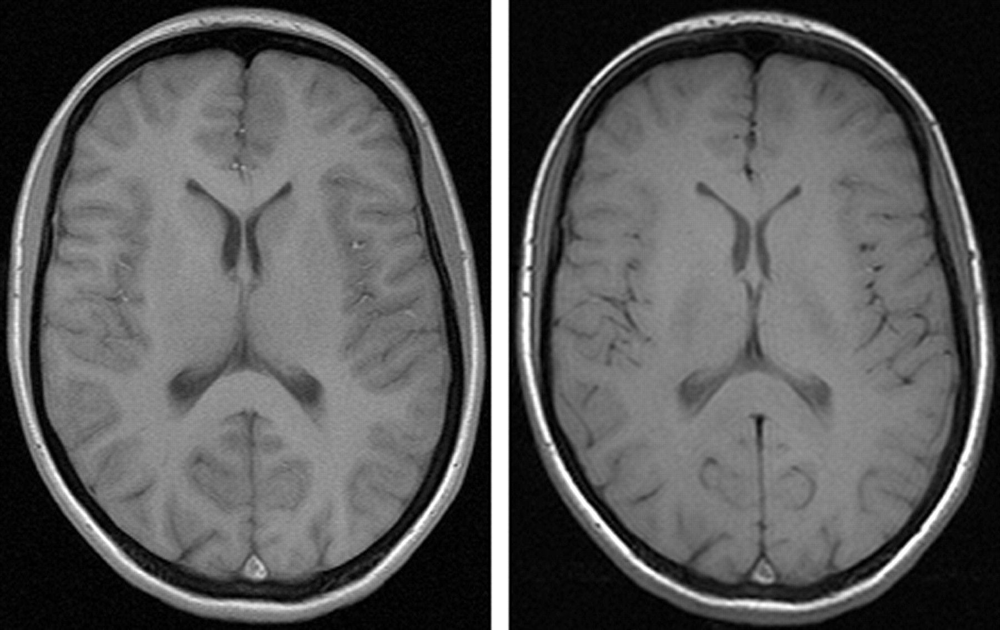

:::::::::::::::::::::::::::::::::::::: questions 

- What are the basic steps involved in preparing images for machine learning?
- How can data be augmented? 
- How to handle data from different sources or acquired under different conditions?
- How to create features for machine learning through radiomics or volumetrics?

::::::::::::::::::::::::::::::::::::::::::::::::

::::::::::::::::::::::::::::::::::::: objectives

- Explain the basic steps involved of preparing images for machine learning
- Demonstrate data augmentation with affines
- Explain the pitfalls of data augmentation
- Explain derived features, including radiomics and other pipeline-derived features
- Review image harmonization techniques at the image and dataset level

::::::::::::::::::::::::::::::::::::::::::::::::

## Basic steps

The images you receive can be the raw data for machine learning. If you are extremely lucky they can be used without much effort, however in many projects the majority of time
spent in building machine learning is spent cleaning up and preparing data. The quality of the data used will have a profound impact on the quality of the models built. 

One of the first steps towards building a model is simply looking at both some of the data and metadata by hand. 

::::::::::::::::::::::::::::::::::::: challenge 

## Challenge 1: Thinking about metadata

What metadata will you want to look at in almost any radiological dataset?

Hint: Think of metadata relevant for brain and thorax imaging. 

:::::::::::::::::::::::: solution 

## Solution
 
You will almost always want to look at age and sex distribution. These are relevant metadata whether you are looking at brain MRIs or chest X-rays. They will also be relevant in a variety of other cases.

:::::::::::::::::::::::::::::::::
:::::::::::::::::::::::::::::::::::::::::::::::::

In the real world we often have a question about a specific pathology that is relatively rare, so we may get a dataset of thousands of normal subjects, and then relatively speaking fewer of and pathology, and perhaps very few of the pathology we care about. This creates an imalanced dataset in general, but once we think about metadata in may also create biases. For example if we want to build a model to detect heart failure on chest X-ray, but all our heart failure patients are older men, we may get a model
that "looks" for the absence of female breasts, and signs of ageing, rather than one that looks for actual signs of heart failure we are familiar with i.e. the ratio of heart to chest diameter (or in the words of radiologists cardiothoracic ratio).

Below are some initial steps to understanding your dataset if you will do supervised machine learning:

1. Check some images by hand (quality, content, surprises)
2. Check some of labeling by hand (quality, content, surprises)
3. Diversity check by obvious protected classes (can be in images or labels or metadata)
4. Conversion of images to a lossless format, and storage of a backup data collection
5. Anonymization can include inside images (OCR (optical character recognition)?)
6. Decide what in images is important, consider cropped versions?
7. Normalizations: size, histogram, other, 'centering' in some cases only
8. Re-examine some images by hand for resize and other artifacts
9. Dataset harmonizations?
10. Augmented and/or synthetic data creation

Preparing images for unsupervised learning has many of the same steps. However, you need to consider the specific algorithm itself e.g. some segmentation algorithms may not benefit from extra data.

In our supervised preparation step 2. we suggest checking labeling, the label or the y, is what you want to predict. You need to make sure the labelling was actually done correctly, and see how may types of labels there are (as opposed to how many you want your models to predict). In step 3. we suggest checking for diversity of protected classes. Protected classes are groups in society who usuallt have specific legislation in terms of medical diagnostic testing and other areas where they have historically been underrepresented. To be more specific blunt, it's proabably not a bad idea to check if your dataset has women and certain ethnic minority groups. Certain measurements may be normal in terms of one population, and not others, for example chest circumference and height are known to differ dramatically on average between Dutch people without a migrant background, and people from Indonesia. If your algorithm is about cerebral blood flow, then this body size might matter very little, but you have to think about the context of your specific algorithm. In step 5 we mention anonymization in terms of images. This is especially the case with ultrasounds. They often have things like the patient name or even the diagnosis burned right onto the image. You may be able to simply crop this away if it is always done in a corner. But if you want to get more sophisticated, you can apply all kinds of blurring and masking, or even use OCR.

We will cover dataset harmonization in a separate section. For step 10 you could create entirely synthetic data, and this will be covered in a seperate episode on generative AI. In the next section, we will work through some examples of augmented data creation.  
To work though our examples of dataset augmentation you will need an appropriate environment. You can build the environment from our `ml_environment` file (see the setup instructions).

Let's switch environments (assuming your environment is called `image_libraries`):

```bash
conda deactivate 
conda activate image_libraries
```

Then we need to get our sample images:

```
TBD
```

Let's go throught some examples. First, we import the libraries we need:

```python
import numpy as np
import matplotlib
from matplotlib import pyplot as plt
from skimage import data
from skimage import transform
from skimage import img_as_float
from skimage.transform import rotate
from skimage import transform as tf
from skimage.transform import PiecewiseAffineTransform
```

Then, we import our example images and examine them.

```python
image_b = io.imread('cardiomegaly_cc0.png') # cardiomegaly CXR
image_g = io.imread('rotatechest.png') # a relatively normal CXR
image_y = io.imread('other_op.png') # a relatively normal CXR
# create figure
fig = plt.figure(figsize=(10, 7))
  
# setting values to rows and column variables
rows = 1
columns = 3

# Adds a subplot at the 1st position
fig.add_subplot(rows, columns, 1)
# showing image
plt.imshow(image_g)
plt.axis('off')
plt.title("Normal 1")
  
# Adds a subplot at the 2nd position
fig.add_subplot(rows, columns, 2)
# showing image
plt.imshow(image_b)
plt.axis('off')
plt.title("Cardiomegaly")

# Adds a subplot at the 3nd position
fig.add_subplot(rows, columns, 3)
# showing image
plt.imshow(image_y)
plt.axis('off')
plt.title("Normal 2")
```

::::::::::::::::::::::::::::::::::::: challenge 

## Thought Challenge: Can you see some problems in the following scenario?

Imagine you got the above images and many more because you  have been assigned to make an algorithm for cardiomegaly detection so patients can be notified if by chance their X-ray shows cardiomegaly. You are given one dataset of healthy (no cardiomegaly) patients who went to an outpatient clinic in a very poor area staffed with first year radiography students. Those patients were under surviellance program for TB. You also got chest X-rays of cardiomegaly patients from an extremely prestigeous tertiary inpatient hospital. 

:::::::::::::::::::::::: solution 

## Solution
 
All of the following may be potential problems:

- We may have different quality images from different machines for our healthy versus diseased in this scenario, this could be called a "batch effect" creating bias
- In the presigous hospital many X-rays may be supine, will these combine well with standing APs?
- We could suspect labelling may not be entirely accurate in the clinic because has by lower level staff 

:::::::::::::::::::::::::::::::::

::::::::::::::::::::::::::::::::::::::::::::::::

::::::::::::::::::::::::::::::::::::: challenge 

## Code Challenge: Using skimage.transform.rotate

Use `skimage.tranform.rotate` to produce two realistic augmented images (name them `new_pic1` and `new_pic2`) from the given 'normal' image we put in `image_g` variable, and then apply what you percieve as the two most critical algorithms to make them ready for classic supervised machine learning in one bit of code.

Hint: look at the shape of the cardiomegaly image in more ways than one.

:::::::::::::::::::::::: solution 

## Solution
 
```python
# code to rotate
new_pic1 = rotate(image_g, -2)
new_pic2 = rotate(image_g, 2)

# crop the images so all without edges
list_images = [image_g, new_pic1, new_pic2]
better_for_ml_list = []
for image in list_images:
    image = image[119:-119, 208: -209]
    better_for_ml_list.append(image)

# create figure for display
fig = plt.figure(figsize=(10, 7))
  
# setting values to rows and column variables
rows = 1
columns = 3

# Adds a subplot at the 1st position
fig.add_subplot(rows, columns, 1)
# showing image
plt.imshow(better_for_ml_list[0])
plt.axis('off')
plt.title("Normal 1")
  
# Adds a subplot at the 2nd position
fig.add_subplot(rows, columns, 2)
# showing image
plt.imshow(better_for_ml_list[1])
plt.axis('off')
plt.title("Augment 1")

# Adds a subplot at the 3nd position
fig.add_subplot(rows, columns, 3)
# showing image
plt.imshow(better_for_ml_list[2])
plt.axis('off')
plt.title("Augment 2")
# now let's make it even better with some crops
# next cells 

# figure out how much to cut on sides
print("cut top/bottom:", (image_b.shape[0] - image_g.shape[0])/2)
cut_top_bottom = abs(round((image_b.shape[0] - image_g.shape[0])/2))

# figure our how much to cut on top and bottom
print("cut sides:",(image_b.shape[1] - image_g.shape[1])/2)

cut_sides = abs(round((image_b.shape[1] - image_g.shape[1])/2))
list_images = [image_g, new_pic1, new_pic2]
better_for_ml_list = []
for image in list_images:
    image = image[cut_top_bottom:-cut_top_bottom, cut_sides: -cut_sides]
    better_for_ml_list.append(image)

# create figure
fig = plt.figure(figsize=(10, 7))
  
# setting values to rows and column variables
rows = 1
columns = 3

# Adds a subplot at the 1st position
fig.add_subplot(rows, columns, 1)
# showing image
plt.imshow(better_for_ml_list[0])
plt.axis('off')
plt.title("Normal 1")
  
# Adds a subplot at the 2nd position
fig.add_subplot(rows, columns, 2)
# showing image
plt.imshow(better_for_ml_list[1])
plt.axis('off')
plt.title("Augment 1")

# Adds a subplot at the 3nd position
fig.add_subplot(rows, columns, 3)
# showing image
plt.imshow(better_for_ml_list[2])
plt.axis('off')
plt.title("Augment 2")

```

:::::::::::::::::::::::::::::::::

::::::::::::::::::::::::::::::::::::::::::::::::

Note that the results are be further enhanced by cropping. Usually we want to avoid harsh artifictual lines in any images
we feed to ML algorithms unless it is always the same line. Of course there are many kinds of transformations of images we can do beyond rotation. Let's look at a shear and a wave over  mesh: 

Shearing: 
```python
# Create Afine transform
afine_tf = tf.AffineTransform(shear=0.2)

# Apply transform to image data
modified = tf.warp(image_b, inverse_map=afine_tf)

# Display the result
io.imshow(modified)
io.show()
```
And finally, let's show a wave over a mesh
```python
rows, cols = modified.shape[0], modified.shape[1]

#np.linspace will return evenly spaced numbers over an interval
src_cols = np.linspace(0, cols, 20)
# ie above is start=0, stop = cols, num = 50, and num is the number of chops
src_rows = np.linspace(0, rows, 10)

# np.meshgrid returns coordinate matrices from coordinate vectors.
src_rows, src_cols = np.meshgrid(src_rows, src_cols)

# nunmpy dstack stacks along a third dimension in the concatenation
src = np.dstack([src_cols.flat, src_rows.flat])[0]
dst_rows = src[:, 1] - np.sin(np.linspace(0, 3 * np.pi, src.shape[0])) * 50
dst_cols = src[:, 0]
dst_rows *= 1.5
dst_rows -= 1.5 * 50
dst = np.vstack([dst_cols, dst_rows]).T

tform = PiecewiseAffineTransform()
tform.estimate(src, dst)
noform = PiecewiseAffineTransform()
noform.estimate(src, src)

out_rows = modified.shape[0] - 1.5 * 50
out_cols = cols
out = tf.warp(modified, tform, output_shape=(out_rows, out_cols))
# create figure
fig = plt.figure(figsize=(10, 7))
  
# setting values to rows and column variables
rows = 1
columns = 4

# Adds a subplot at the 1st position
fig.add_subplot(rows, columns, 1)
# showing image
plt.imshow(modified)
plt.axis('off')
plt.title("Normal")
  
# Adds a subplot at the 2nd position
fig.add_subplot(rows, columns, 2)
# showing image
plt.imshow(modified)
plt.plot(noform.inverse(src)[:, 0], noform.inverse(src)[:, 1], '.b')
plt.axis('off')
plt.title("Normal and Mesh")

# Adds a subplot at the 3nd position
fig.add_subplot(rows, columns, 3)
# showing image
plt.imshow(out)

plt.axis('off')
plt.title("Augment")

# Adds a subplot at the 3nd position
fig.add_subplot(rows, columns, 4)
# showing image
plt.imshow(out)
plt.plot(tform.inverse(src)[:, 0], tform.inverse(src)[:, 1], '.b')
plt.axis('off')
plt.title("Augment and Mesh")
```

That last transform doesn't look so realistic. The chest became very wide, and it was obvious,
but there are other potential augmentations that could get us into trouble we might not see.
When it comes to augmenting data, there are many possibilities. Just be careful to make realistically augmented data.
Only a subject matter expert, usually a pathology or nuclear medicine or radiology specialist, will know what 
that literally looks like.

## Images' features

Until now we have worked on an example where we were working directly on images.
A lot of machine learning can be done on values derived from images (which we typically turn into tabular data). In fact you can even combine images and all kinds of tabular data for machine learning in various ways; but before we discuss this, let's consider image features (which we can organize into tabular data along with patient and/or machine charecteristics) as an input for machine learning.

Two examples are of image features are volume data and radiomic data. 
Of course at scale we do not want to measure our images to get volume data or other measurements. Legend has it that Benjamin Felson (an undeniable grandfather of modern chest X-ray analysis) got some of his statistics about chest X-rays by reading hundreds and hundreds by hand and counting. Numbers, for research subjects, in the hundreds now seem quiant. With pre-built pipelines we now have the power to process thousands of images at a time. 

We want to put images into a pipeline that will give us these data back. An example of such a feature pipeline (for brain imaging) is [Freesurfer](https://surfer.nmr.mgh.harvard.edu/). It helps us to get volume and some other data from brain imaging. 

::::::::::::::::::::::::::::::::::::: challenge  

## Thought Challenge: Can you see some problems in using output of a pipeline without acessing the original images?

Think of a couple scenarios where this could be problematic, and possible solutions.

:::::::::::::::::::::::: solution  

## Solution
 
No one really gauruntees the accuracy of most pipelines. The authors of
this lesson have had experiences when checking back on images they discovered the 
pipeline had mislabelled or miscounted features.   The most important step you can take is to check some of your data by hand. If that is not possible, use existing literature to figure out what is actually likely for counts and volumes. You could also ask a radiologist if the numbers 'feel' correct. If your counts and volumes make no sense by what is known, you probably have a faulty pipeline, proceeed with caution.

:::::::::::::::::::::::::::::::::

::::::::::::::::::::::::::::::::::::::::::::::::::::::::::::::::::

Morphometric or volumetric data is just one type of derived data. Radmiomics is another. Radiomics is the study of the mathematic qualities of areas of images, for example the entropy or kurtosis. Typically we want to segment and/or mask an image down to the area we care about, then apply some code to derive radiomic features. While we could write the code ourselves, it's better to use a known package for reproducibility. To be truly reproducible in the future we should also think about the standards of the International Bio-imaging Stanstards Initiative [IBSI](https://theibsi.github.io/). Below is a table of open* libaries:


|        | `mirp`    | `pyradiomics`        | `LIFEx`           |`radiomics`           |
|--------|-----------|-----------------------|-----------------|-----------------| 
| License     | EUPL-1.2              | BSD-3             | custom           | GPL-3.0      |
| Last updated    | 5/2024      | 1/2024           | 6/2023         | 11/2019          |
| Programming language | Python        | Python                         | Java            | MATLAB           |
| IBSI-1 compliant     | yes              | partial              | yes             | no claim             |
| IBSI-2 compliant     | yes        | no claim           | yes           | no claim        |
| Interface            | high-level API       | high-level API, Docker| GUI, low-level API    | low-level API      |
| Website     | [GitHub](https://github.com/oncoray/mirp) | [GitHub](https://github.com/AIM-Harvard/pyradiomics)  | [website](https://www.lifexsoft.org/) | [GitHub](https://github.com/mvallieres/radiomics)    | 
| Early Publication |[pending JOSS publication](https://joss.theoj.org/papers/165c85b1ecad891550a21b12c8b2e577)| [doi:10.1158/0008-5472.CAN-17-0339](https://doi.org/10.1158/0008-5472.CAN-17-0339)  |[doi:10.1158/0008-5472.CAN-18-0125](https://doi.org/10.1038/s41598-022-16609-1)|[doi:10.1088/0031-9155/60/14/5471](https://doi.org/10.1088/0031-9155/60/14/5471)| 
| Notes |    relative newcomer    | very standard and supported| user-friendly   | * MATLAB requires a license | 

Once we have tabular data we can apply all kinds of algorithms to it. But the process is not as simple as adding ML and shaking. In the next section we will explore one reason why.

## Harmonization

We will often have to harmonize either images or derived feature datasets. With images if the differences between datasets are start we will notice them with our eyes. For example if one set of X-rays has images that are always darker, we could intuit it might be a good idea to look at the average pixel values for each set, and perhaps renorm the sets to be more like each other. This is a simple case. Imagine we have two derived datasets on brain MRIs with Virchow Robin's spaces. We know one dataset was shot on a 1.5 Tesla machine in a faraway land, and the other on an experimental 5 Tesla machine (high resolution) in an advanced hospital. We expect differences in resolutions, therefore what may read as a single Virchow Robin's space at low resolution, may actually be two or even three small ones fused together (and we may see this at high resolution). This is only one potential difference. Examine the images of the same patient below from a 1.5 and 3T machine:

{alt='T1 v T3'}

*Sourced from [Bernd L. Schmitz, Andrik J. Aschoff, Martin H.K. Hoffmann and Georg Grön, Advantages and Pitfalls in 3T MR Brain Imaging: A Pictorial Review ,American Journal of Neuroradiology October 2005, 26 (9) 2229-2237](https://www.ajnr.org/content/26/9/2229)*

Different contrast levels make the caudate and thalami far more or less apparent. The radiomics of these brain images are different in terms of contrast, and probably some other parameters, even though it is literally the same patient.

We can't simply build a dataset based on unharmonized derived data. On the other hand, we may not have access to the images, to even guess how things are going differently.

We suggest the following approach: 

1. Compare the data yourself in terms of descriptive statistics and what you know about the two patient groups (do you expect the same counts in each group? why or why not?).
2. Consider a harmonization package.

Below are a three examples from the world of neuroimaging:

|             | `neurocombat`    | `haca3`        | `autocombat`           |
|-------------|------------------|----------------|------------------------|
| License     | MIT for Python/ Artistic for R  | Missing?   | Apache 2.0  |
| Last updated| 2021             | 2024           |2022        | 
| Programming language | Python or R     | Python      | Python         | 
| Organ/area and modality | brain MRI     | brain MRI              | brain MRI  |
| Data type |  derived values    | images        | derived values       | 
| Notes     | no release yet standard   | versioned but not released   | no releases not versions           |
| Original Website     | [GitHub](https://github.com/Jfortin1/ComBatHarmonization) | [GitHub](https://github.com/lianruizuo/haca3) | [GitHub](https://github.com/Alxaline/ComScan)    | 
| Early Publication |[doi: 10.1016/j.neuroimage.2017.08.047](https://doi.org/10.1016/j.neuroimage.2017.08.047)| [doi:10.1016/j.compmedimag.2023.102285](https://doi.org/10.1016/j.compmedimag.2023.102285)  |[doi: 10.1038/s41598-022-16609-1 ](https://doi.org/10.1038/s41598-022-16609-1)|
| Verioned website |  [versioned on cvasl](https://github.com/brainspinner/cvasl/tree/main/cvasl/vendor/neurocombat) | [versioned on GitHub](https://github.com/lianruizuo/haca3)| [versioned on cvasl](https://github.com/brainspinner/cvasl/tree/main/cvasl/vendor/autocombat)  

There are countless examples of such packages for brain MRI alone, let alone the rest of the body. We choose these three to show some of the issues and pitfalls with such packages. 

::::::::::::::::::::::::::::::::::::: challenge  

## Thought Challenge: Can you see some potential problems in each package?

Think of an issue that may hinder your implementation for each package.

:::::::::::::::::::::::: solution  

## Solution
 
Aging code: Neurocombat was last modified three years ago. The code may well be based on dependencies we don't want to chase after. Will they be compatiable with our brand new machine? An additional issue wth neurocombat is the lack of verioned release. 

No lisence: haca3 has no lisence we can find. Really legally we can't use other people's code without a clear license. 

No releases and versioning: Autocombat has no releases and no verioning. If a package never had released versions, can we compare across different uses of it. Maybe not, because the code may have changed.

:::::::::::::::::::::::::::::::::

::::::::::::::::::::::::::::::::::::::::::::::::::::::::::::::::::

We point out the following problems to make you aware of some potential pitfalls with such programs. We hope you will one day build a harmonization package that is also sustainable and reusable for the community of researchers you work with. All of the above packages have many truly positive aspects that make them notable for the research community. Alas no package is perfect. Choose wisely! And don't forget you could also make your own harmonization though code or even step this code up to a package so others can also benefit. 

:::::::::::::::::::::::::::::::::::::::: keypoints

- There is no way to replace direct knowledge of some data
- Examine data statistically to see if they can create or amplify biases in terms of patient distribution
- Statistically examine derived data to see if it corresponds to realities known to specialists
- Not all ways of augmenting data are valid or useful
- Radiomics allows mathematical qualities of images to be used as features
- Various open pipelines for volumetrics and radiomics are available
- Data produced by different machines often needs harmonization, which can be accomplished with code and/or existing libraries

::::::::::::::::::::::::::::::::::::::::::::::::::
